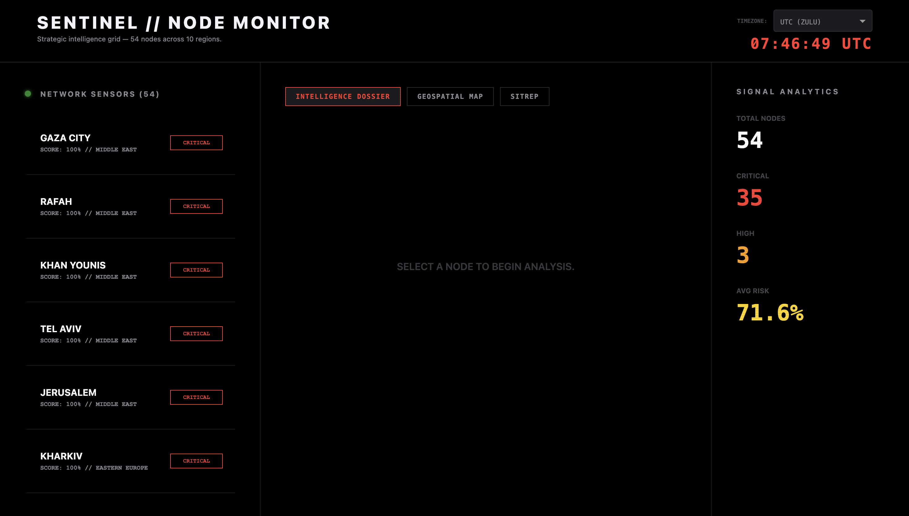

# Sentinel: Geopolitical Conflict Monitor

A real-time dashboard for monitoring global conflict signals. Utilizes a rule-based NLP pipeline to scrub high-velocity news feeds and reconstruct fragmented headlines into formal tactical SITREPs, enabling early detection of emerging regional instability.

## Dashboard Preview

## Technical Stack
- **Language:** Python 3.10+
- **Framework:** Plotly Dash (Interactive Visualization)
- **Data Processing:** Pandas, RegEx (Rule-Based NLP Logic)
- **Data Source:** RSS Feeds & Live News Integration

## Core Functionality
- **Real-time Monitoring:** Automated scraping of global conflict signals from RSS feeds.
- **SITREP Generation:** A rule-based NLP engine that reconstructs fragmented news headlines into subject-led tactical SITREPs.
- **Global Node Grid:** Tracks real-time intelligence across 15 strategic coordinates (Lat/Lon) with automated risk scoring

## How to Run
1. Clone the repository: `git clone https://github.com/Kenneth-Thakur/Sentinel-Monitor.git`
2. Install dependencies: `pip install -r requirements.txt`
3. Run the application: `python sentinel.py`
